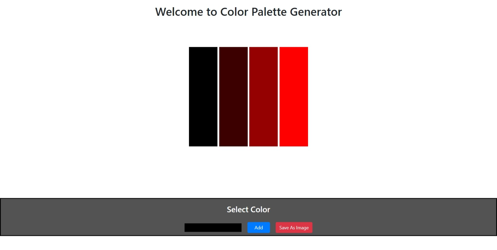

# Color Plate Genaretor

Proper color use is important for creating a positive image for your customers, that’s why color plays a leading role in interface design. It stimulates all senses by delivering a message instantaneously like no other method of communication. This is a simple javaScript Web-application. Which can be used for selecting a color theme for your System, Application, or anything related to Styling. 

You can check it out on its live page "https://shivchevli.github.io/SideProjects/ColorPaletteGenretor/"

# Layout of application

