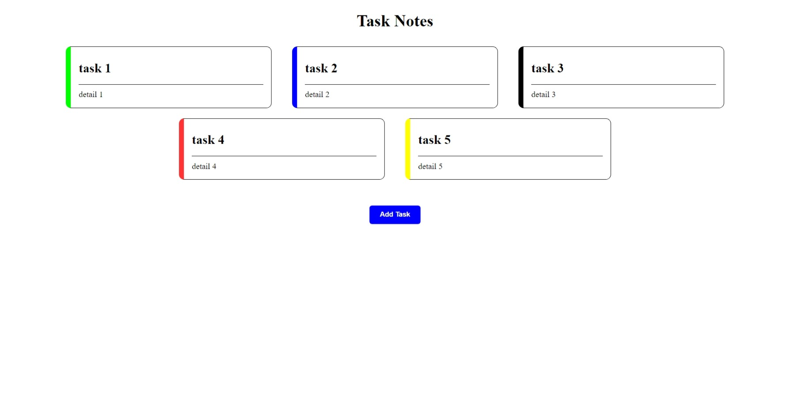

# To-do Notes App Using React and Redux

## Discription

Here I have created some Reusable components which is used for builing this small app. Main logic of this app resides in Taskmanager Components and all data are stored/acess using Redux
<ul>
    <li>Button</li>
    <li>Modals</li>
    <li>Input Components</li>
</ul>

# Download and Run Project

Prereurist for this project is you must have node and git installed in your system. If you don't have it, you can download and install the node from its official <a href="https://nodejs.org/en/">Website</a>. After that, run Following Command in the OS terminal.

## First Colne Repository

```bash
    git clone https://github.com/ShivChevli/SideProjects.git
```
or <br>
you can download it as a zip from the above code button. 

## Change to Project Directory 

```bash
    cd .\SideProjects\TodoApp\
```

## To start project run
```bash
    npm start 
```

<br>



