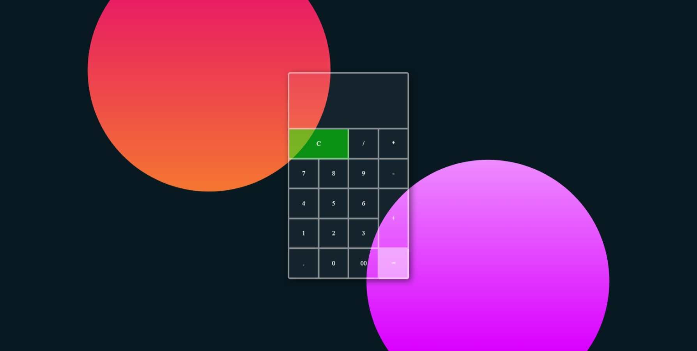

# Web calculator

It is a Transparent Calculator Design. Created to Practice my CSS Knowledge and also to try newly found library Vanilla-tilt.js. This project was created on 8th  October, 2020

This Project is insprire by  <a href="https://www.youtube.com/watch?v=8UWkR1H5E4o" > transparent Credetcard project </a>

Watch the live preview on the link [https://shivchevli.github.io/SideProjects/WebCalculator/](https://shivchevli.github.io/SideProjects/WebCalculator/)

 

